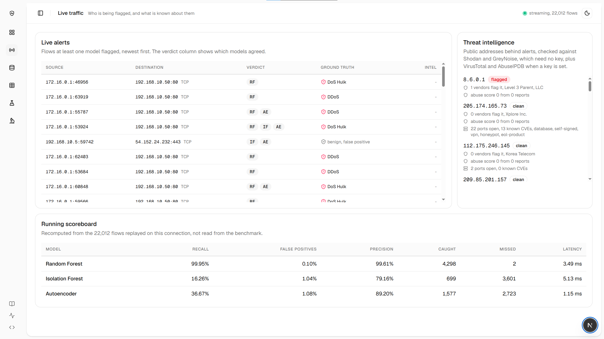
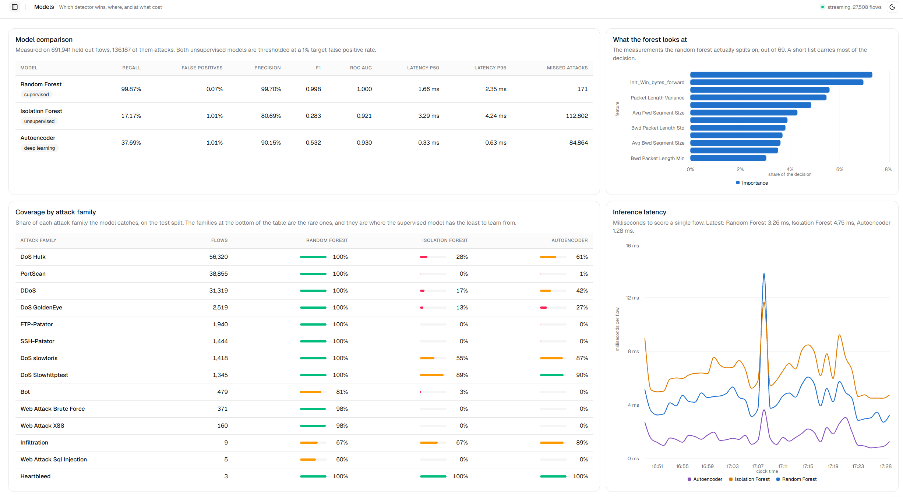
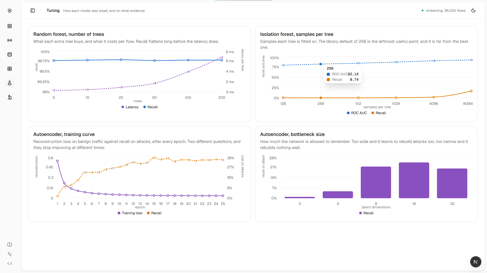
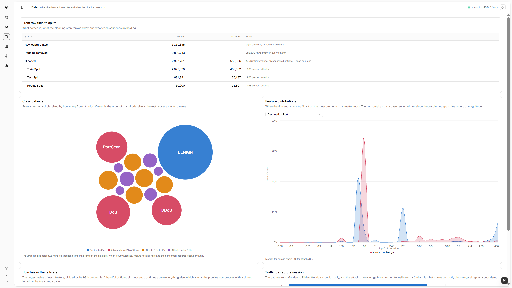

<div align="center">


# Flow Sentry

**Three intrusion detectors watch the same network traffic and disagree about it.
This project measures exactly how.**

[](https://www.python.org)
[](https://scikit-learn.org)
[](https://pytorch.org)
[](https://fastapi.tiangolo.com)
[](https://nextjs.org)
[](https://www.docker.com)

[](https://www.unb.ca/cic/datasets/ids-2017.html)
[](#results)
[](#results)
[](#results)
[](#results)
[](#tests)
[](report/)

</div>

---

## What this is

A random forest, an isolation forest and a PyTorch autoencoder are trained on
five days of real network traffic, then served behind one API that scores flows
one at a time. A dashboard replays held out traffic through all three at once and
shows what each catches, what each misses, and how long each takes to decide.

The supervised model reaches 99.87 percent recall. That number is easy to get on
this dataset and easy to overstate, so most of the work here is in the parts that
qualify it.

**Three findings, each measured rather than assumed.**

> A random train and test split leaves **27.8 percent of the test attacks with a
> byte identical twin in the training half**, because a denial of service burst
> produces thousands of identical flows.

> The forest reaches its recall at **five trees** and every tree after that only
> costs latency. The scikit-learn default for the isolation forest sits near the
> **worst end of its own curve**.

> Remove one attack family from training and the supervised model does not
> degrade, it **collapses to zero on three families out of six**. The
> unsupervised models recover a third of the loss on two and nothing on the rest.

## How a flow travels through it

<div align="center">

</div>

## What it looks like

<table>
<tr>
<td width="50%"></td>
<td width="50%"></td>
</tr>
<tr>
<td><b>Live traffic.</b> One row per flow a model flagged, the ground truth beside
it, and what the outside world knows about the public addresses.</td>
<td><b>Models.</b> The comparison table, recall per attack family, and what the
forest actually splits on.</td>
</tr>
<tr>
<td></td>
<td></td>
</tr>
<tr>
<td><b>Tuning.</b> Every hyperparameter read off a curve rather than picked.</td>
<td><b>Data.</b> What the dataset holds, and what the pipeline does to it.</td>
</tr>
</table>

## Results

On 691,941 held out flows, 136,187 of them attacks. Both unsupervised models are
thresholded on the benign score distribution at a 1 percent target false positive
rate, so the comparison is fair.

| Model | Type | Recall | False positives | Latency per flow |
| --- | --- | --- | --- | --- |
| Random Forest | supervised | **99.87%** | **0.07%** | 1.66 ms |
| Isolation Forest | unsupervised | 17.24% | 1.01% | 3.29 ms |
| Autoencoder | deep learning | 37.69% | 1.01% | **0.33 ms** |

The headline is not the interesting part. This is:

| Attack family | Test flows | Random Forest | Isolation Forest | Autoencoder |
| --- | --- | --- | --- | --- |
| DoS Hulk | 56,320 | 100% | 28% | 61% |
| PortScan | 38,855 | 100% | 0% | 1% |
| DoS Slowhttptest | 1,345 | 100% | 89% | 90% |
| Bot | 479 | 81% | 3% | 0% |
| Infiltration | 9 | 67% | 67% | **89%** |
| Heartbleed | 3 | 100% | 100% | 100% |

The supervised model wins almost everywhere and is weakest on the two rarest
families. Those are the only two places an unsupervised model competes, and on
Infiltration the autoencoder beats it outright. Neither unsupervised model sees a
port scan at all, because a port scan is a small, perfectly ordinary looking flow.

That is the argument for keeping three models rather than shipping the one with
the best number.

## The written report

Seven pages in [`report/`](report/): the method and the measurements in the body,
every figure in the appendix.

```bash
python -m ids.report.figures
cd report && pdflatex -output-directory=build main.tex
```

Every figure is drawn by a command from the same JSON the dashboard reads, so the
paper and the browser cannot tell different stories.

## Running it

Python 3.11 or newer, Node 20 or newer.

```bash
python -m venv .venv
.venv/Scripts/python.exe -m pip install -r requirements.txt
.venv/Scripts/python.exe -m pip install torch==2.5.1 --index-url https://download.pytorch.org/whl/cpu
.venv/Scripts/python.exe -m pip install -e . --no-deps
```

The CPU wheel index is deliberate: the default PyTorch wheel bundles CUDA and
weighs several gigabytes, which a small dense network over 69 tabular features
has no use for. On Linux or macOS, `.venv/bin/python` replaces
`.venv/Scripts/python.exe` throughout.

```bash
.venv/Scripts/python.exe -m ids.data.download               # 300 MB into data/raw
.venv/Scripts/python.exe -m ids.data.explore --out reports  # read this first
.venv/Scripts/python.exe -m ids.data.preprocess             # about 2 minutes
.venv/Scripts/python.exe -m ids.train                       # about 7 minutes
.venv/Scripts/python.exe -m ids.benchmark                   # about 4 minutes
```

Then two terminals:

```bash
.venv/Scripts/python.exe -m uvicorn ids.api.main:app --port 8000
```

```bash
cd frontend && npm install && npm run dev
```

Dashboard on <http://localhost:3000>, API documenting itself on
<http://localhost:8000/docs>. Or `docker compose up --build` for the same two
addresses.

Four more experiments feed the Tuning and Evidence pages. Optional, any order:

```bash
.venv/Scripts/python.exe -m ids.sweep      # hyperparameter curves
.venv/Scripts/python.exe -m ids.curves     # ROC, thresholds, distributions
.venv/Scripts/python.exe -m ids.validate   # how much the split flatters things
.venv/Scripts/python.exe -m ids.novelty    # attacks nobody trained on
```

## The dashboard

Six pages, each answering one question rather than one long scroll.

| Page | Question |
| --- | --- |
| Overview | What is the sensor doing right now |
| Live traffic | Who is being flagged, and what is known about them |
| Data | What does the dataset hold, and what does the pipeline do to it |
| Models | Which detector wins, where, and at what cost |
| Tuning | How was each model sized, and on what evidence |
| Evidence | Why should any of these numbers be believed |

The replay stream sends flows held out before training, one at a time, at a rate
you set from 4 to 80 per second. The running scoreboard recomputes recall and
false positive rate from the flows that have actually gone past, and watching it
converge on the benchmark is the check that the served models are the ones that
were measured.

Alerts on public addresses are enriched by four services. Shodan and GreyNoise
answer without an API key, so enrichment works on a fresh clone. VirusTotal and
AbuseIPDB add reputation when a free key is set in `.env`.

## Reading the code

In this order:

| # | File | What you learn |
| --- | --- | --- |
| 1 | [`data/explore.py`](src/ids/data/explore.py) | What the dataset looks like and why it needs cleaning |
| 2 | [`config.py`](src/ids/config.py) | Paths, sessions, which columns are features and which are not |
| 3 | [`data/preprocess.py`](src/ids/data/preprocess.py) | Cleaning, timestamp parsing, and the three splits |
| 4 | [`models/scaling.py`](src/ids/models/scaling.py) | Why a signed logarithm and not standardisation |
| 5 | [`models/autoencoder.py`](src/ids/models/autoencoder.py) | The network, and reconstruction error as a score |
| 6 | [`train.py`](src/ids/train.py) | The three models, and how their thresholds are calibrated |
| 7 | [`detectors.py`](src/ids/detectors.py) | The shared interface that keeps serving and measuring identical |
| 8 | [`benchmark.py`](src/ids/benchmark.py) | Which metrics mean anything here, and which do not |

Then [`sweep.py`](src/ids/sweep.py), [`curves.py`](src/ids/curves.py),
[`validate.py`](src/ids/validate.py) and [`novelty.py`](src/ids/novelty.py) for
the experiments, [`api/`](src/ids/api/) for the service, and
[`frontend/src/`](frontend/src/) for the dashboard.

## Decisions worth explaining

**The labelled flow release, not the machine learning CSVs.** Both carry the same
78 features. Only the first keeps the addresses and timestamps, without which the
threat intelligence has nothing real to look up and the replay has no capture
order to follow.

**Accuracy is never quoted.** Four flows in five are benign, so a model that
never raises an alert already scores above 80 percent.

**A signed logarithm rather than a quantile transform.** The largest value of
some features sits nine thousand times above their own 99th percentile. A
quantile transform handles that, and cost 20 ms per row, more than all three
models spent deciding. `sign(x) log(1+|x|)` compresses the same tails in
microseconds.

**One worker when serving.** Training spreads over every core. Scoring a single
row, handing the work to a thread pool costs more than the work itself. This
alone took the forest from 17 ms to 3 ms per flow.

**One threshold rule for both unsupervised models.** Each takes its threshold
from its own benign score distribution at the same target false positive rate.
Without it they would be compared at whatever operating point their library
happened to default to.

## Tests

```bash
.venv/Scripts/python.exe -m pytest
```

Sixteen tests over the scaler, the cleaning step and the threat intelligence
client. The scaler tests found a real bug: a feature that never varies has a
standard deviation around 1e-16 rather than zero, so the guard against dividing
by zero never fired.

## Dataset

Sharafaldin, Lashkari and Ghorbani, *Toward Generating a New Intrusion Detection
Dataset and Intrusion Traffic Characterization*, ICISSP 2018.
<https://www.unb.ca/cic/datasets/ids-2017.html>

The University of New Brunswick serves it behind a registration form that cannot
be scripted, so [`data/download.py`](src/ids/data/download.py) pulls the same
files from a public mirror.
